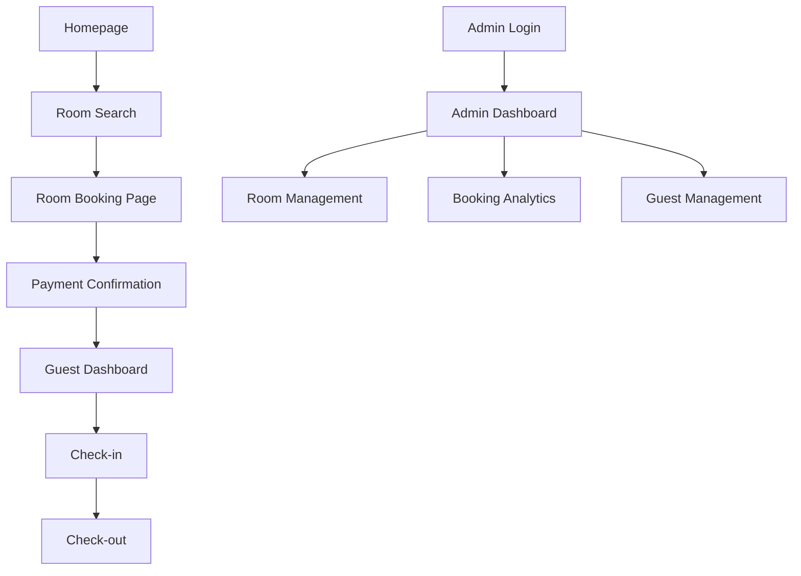

## 1. Product Overview

Kumbisaly Heritage Hotel Management System is a comprehensive digital solution for managing hotel operations at the Kumbisaly Heritage Hotel located in Offinso Abofour, Ashanti, Ghana. The system streamlines room bookings, guest management, and administrative tasks for hotel staff while providing guests with a seamless booking experience.

This web-based platform addresses the need for efficient hotel management by digitizing reservation processes, guest records, room availability tracking, and financial reporting, helping the hotel improve operational efficiency and guest satisfaction.

## 2. Core Features

### 2.1 User Roles

| Role | Registration Method | Core Permissions |
|------|---------------------|------------------|
| Hotel Manager | Admin account creation | Full system access, financial reports, staff management |
| Receptionist | Admin account creation | Room bookings, guest check-in/out, room status updates |
| Guest | Online registration | Room booking, reservation management, profile updates |

### 2.2 Feature Module

Our hotel management system consists of the following main pages:

1. **Homepage**: Hotel overview, contact information, booking search.
2. **Room Booking Page**: Room availability, reservation form, payment details.
3. **Guest Management Page**: Guest profiles, booking history, check-in/out.
4. **Admin Dashboard**: Room management, booking analytics, staff overview.
5. **Login/Register Page**: User authentication, account creation.

### 2.3 Page Details

| Page Name | Module Name | Feature description |
|-----------|-------------|---------------------|
| Homepage | Hero Section | Display hotel information, location details, contact (+233535975422, info@kumbisalyheritagehotel.com). |
| Homepage | Booking Search | Search available rooms by check-in/out dates, room type, guest count. |
| Room Booking Page | Room Gallery | Display available rooms with images, amenities, and pricing. |
| Room Booking Page | Reservation Form | Collect guest details, payment information, special requests. |
| Guest Management Page | Guest Profile | View/edit personal information, contact details, ID verification. |
| Guest Management Page | Booking History | Display past and current reservations with status tracking. |
| Guest Management Page | Check-in/Check-out | Process arrival/departure, room key assignment, bill settlement. |
| Admin Dashboard | Room Management | Add/edit room details, set availability, update pricing. |
| Admin Dashboard | Booking Analytics | View occupancy rates, revenue reports, booking trends. |
| Admin Dashboard | Staff Management | Create staff accounts, assign roles, monitor activities. |
| Login/Register Page | Authentication | Secure login for staff and guests, password recovery. |

## 3. Core Process

**Guest Booking Flow**: Guest visits homepage → Searches available rooms → Selects room and dates → Fills reservation form → Makes payment → Receives confirmation → Checks in at arrival → Checks out at departure.

**Staff Management Flow**: Staff logs in → Accesses dashboard → Manages room availability → Processes guest check-ins → Updates booking status → Generates reports → Manages guest requests.

## 4. User Interface Design

### 4.1 Design Style

- **Primary Colors**: Deep gold (#D4AF37) and rich brown (#8B4513) reflecting heritage theme
- **Secondary Colors**: Cream (#F5F5DC) and dark green (#228B22) for contrast
- **Button Style**: Rounded corners with subtle shadows, hover effects
- **Typography**: Serif fonts for headers (Georgia), Sans-serif for body (Arial)
- **Layout**: Card-based design with intuitive navigation
- **Icons**: Traditional African patterns and modern hospitality symbols

### 4.2 Page Design Overview

| Page Name | Module Name | UI Elements |
|-----------|-------------|-------------|
| Homepage | Hero Section | Full-width banner with hotel image overlay, welcome message in gold text, call-to-action buttons. |
| Room Booking Page | Room Cards | Grid layout with room images, price badges, amenity icons, book now buttons. |
| Guest Management | Profile Section | Clean form layout with profile photo upload, editable fields, save changes button. |
| Admin Dashboard | Analytics Cards | Dashboard widgets with occupancy charts, revenue graphs, quick action buttons. |

### 4.3 Responsiveness

Desktop-first design approach with mobile adaptation. Touch interaction optimization for tablets and smartphones used by reception staff. Responsive grid layouts that adjust from 4 columns on desktop to 1 column on mobile.