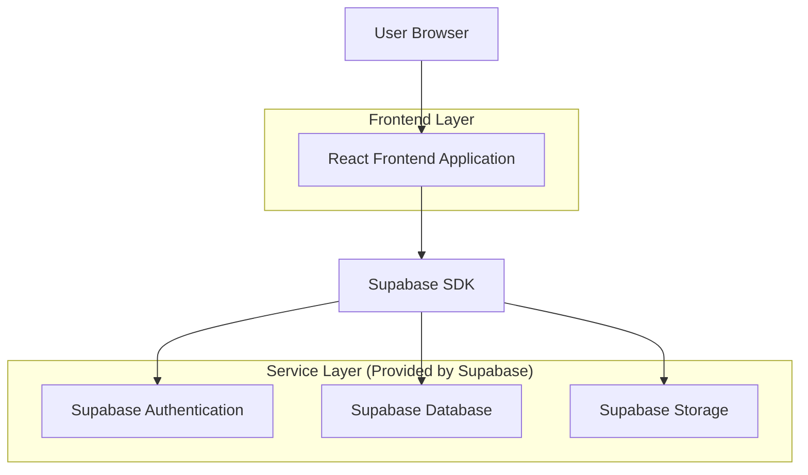
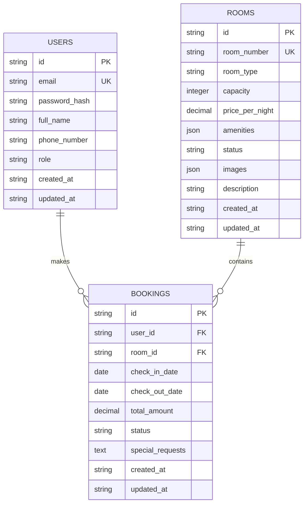

## 1. Architecture Design



## 2. Technology Description

* **Frontend**: React\@18 + TypeScript\@5 + Tailwind CSS\@3 + Vite

* **Initialization Tool**: vite-init

* **Backend**: Supabase (BaaS)

* **Database**: PostgreSQL (via Supabase)

* **Authentication**: Supabase Auth

* **File Storage**: Supabase Storage

## 3. Route Definitions

| Route            | Purpose                                             |
| ---------------- | --------------------------------------------------- |
| /                | Homepage with hotel information and booking search  |
| /rooms           | Room availability and booking page                  |
| /booking/:id     | Individual booking confirmation and details         |
| /guest/dashboard | Guest profile and booking management                |
| /admin/dashboard | Admin dashboard with analytics and management tools |
| /admin/rooms     | Room management interface                           |
| /admin/bookings  | Booking management and calendar view                |
| /admin/guests    | Guest management and profiles                       |
| /login           | User authentication page                            |
| /register        | Guest registration page                             |

## 4. API Definitions

### 4.1 Core API Endpoints

**Authentication**

```
POST /auth/v1/token
```

Request:

| Param Name | Param Type | isRequired | Description        |
| ---------- | ---------- | ---------- | ------------------ |
| email      | string     | true       | User email address |
| password   | string     | true       | User password      |

**Room Management**

```
GET /rest/v1/rooms
POST /rest/v1/rooms
PUT /rest/v1/rooms/:id
```

Room Entity:

```typescript
interface Room {
  id: string
  room_number: string
  room_type: 'single' | 'double' | 'suite' | 'deluxe'
  capacity: number
  price_per_night: number
  amenities: string[]
  status: 'available' | 'occupied' | 'maintenance'
  images: string[]
  description: string
  created_at: string
  updated_at: string
}
```

**Booking Management**

```
GET /rest/v1/bookings
POST /rest/v1/bookings
PUT /rest/v1/bookings/:id
```

Booking Entity:

```typescript
interface Booking {
  id: string
  guest_id: string
  room_id: string
  check_in_date: string
  check_out_date: string
  total_amount: number
  status: 'pending' | 'confirmed' | 'checked_in' | 'checked_out' | 'cancelled'
  special_requests: string
  created_at: string
  updated_at: string
}
```

## 5. Data Model

### 5.1 Data Model Definition



### 5.2 Data Definition Language

**Users Table**

```sql
CREATE TABLE users (
  id UUID PRIMARY KEY DEFAULT gen_random_uuid(),
  email VARCHAR(255) UNIQUE NOT NULL,
  password_hash VARCHAR(255) NOT NULL,
  full_name VARCHAR(255) NOT NULL,
  phone_number VARCHAR(20),
  role VARCHAR(20) DEFAULT 'guest' CHECK (role IN ('guest', 'receptionist', 'manager')),
  created_at TIMESTAMP WITH TIME ZONE DEFAULT NOW(),
  updated_at TIMESTAMP WITH TIME ZONE DEFAULT NOW()
);

-- Indexes
CREATE INDEX idx_users_email ON users(email);
CREATE INDEX idx_users_role ON users(role);
```

**Rooms Table**

```sql
CREATE TABLE rooms (
  id UUID PRIMARY KEY DEFAULT gen_random_uuid(),
  room_number VARCHAR(10) UNIQUE NOT NULL,
  room_type VARCHAR(20) NOT NULL CHECK (room_type IN ('single', 'double', 'suite', 'deluxe')),
  capacity INTEGER NOT NULL CHECK (capacity > 0),
  price_per_night DECIMAL(10,2) NOT NULL CHECK (price_per_night > 0),
  amenities JSONB DEFAULT '[]',
  status VARCHAR(20) DEFAULT 'available' CHECK (status IN ('available', 'occupied', 'maintenance')),
  images JSONB DEFAULT '[]',
  description TEXT,
  created_at TIMESTAMP WITH TIME ZONE DEFAULT NOW(),
  updated_at TIMESTAMP WITH TIME ZONE DEFAULT NOW()
);

-- Indexes
CREATE INDEX idx_rooms_status ON rooms(status);
CREATE INDEX idx_rooms_type ON rooms(room_type);
```

**Bookings Table**

```sql
CREATE TABLE bookings (
  id UUID PRIMARY KEY DEFAULT gen_random_uuid(),
  user_id UUID NOT NULL REFERENCES users(id) ON DELETE CASCADE,
  room_id UUID NOT NULL REFERENCES rooms(id) ON DELETE CASCADE,
  check_in_date DATE NOT NULL,
  check_out_date DATE NOT NULL,
  total_amount DECIMAL(10,2) NOT NULL CHECK (total_amount > 0),
  status VARCHAR(20) DEFAULT 'pending' CHECK (status IN ('pending', 'confirmed', 'checked_in', 'checked_out', 'cancelled')),
  special_requests TEXT,
  created_at TIMESTAMP WITH TIME ZONE DEFAULT NOW(),
  updated_at TIMESTAMP WITH TIME ZONE DEFAULT NOW(),
  CONSTRAINT valid_dates CHECK (check_out_date > check_in_date)
);

-- Indexes
CREATE INDEX idx_bookings_user_id ON bookings(user_id);
CREATE INDEX idx_bookings_room_id ON bookings(room_id);
CREATE INDEX idx_bookings_status ON bookings(status);
CREATE INDEX idx_bookings_dates ON bookings(check_in_date, check_out_date);
```

**Row Level Security (RLS) Policies**

```sql
-- Enable RLS
ALTER TABLE users ENABLE ROW LEVEL SECURITY;
ALTER TABLE rooms ENABLE ROW LEVEL SECURITY;
ALTER TABLE bookings ENABLE ROW LEVEL SECURITY;

-- Users policies
CREATE POLICY "Users can view own profile" ON users FOR SELECT USING (auth.uid() = id);
CREATE POLICY "Managers can view all users" ON users FOR SELECT USING (auth.jwt() ->> 'role' = 'manager');

-- Rooms policies
CREATE POLICY "Anyone can view available rooms" ON rooms FOR SELECT USING (status = 'available');
CREATE POLICY "Staff can manage all rooms" ON rooms FOR ALL USING (auth.jwt() ->> 'role' IN ('receptionist', 'manager'));

-- Bookings policies
CREATE POLICY "Users can view own bookings" ON bookings FOR SELECT USING (auth.uid() = user_id);
CREATE POLICY "Staff can manage all bookings" ON bookings FOR ALL USING (auth.jwt() ->> 'role' IN ('receptionist', 'manager'));
CREATE POLICY "Users can create bookings" ON bookings FOR INSERT WITH CHECK (auth.uid() = user_id);
```

